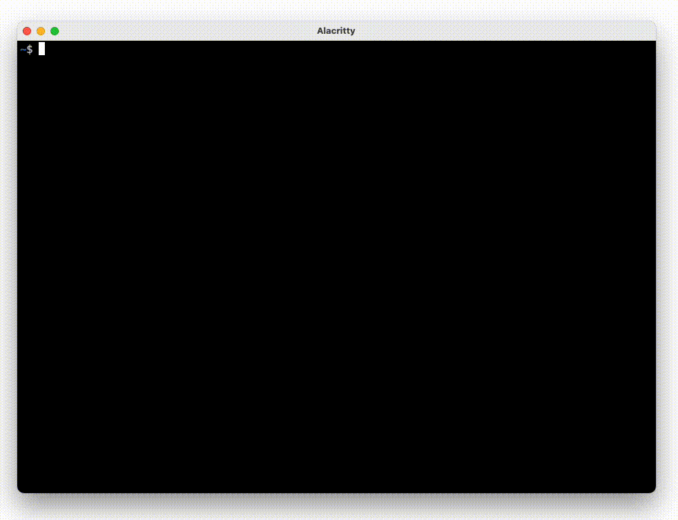

# `gh-sql`: Query GitHub Projects (beta) with SQL



## Installation

```
gh extension install KOBA789/gh-sql
```
**NOTE: Currently, only linux-amd64 is supported. See: [#1](https://github.com/KOBA789/gh-sql/issues/1)**

## Features

- `SELECT` items
- `DELETE` items
- `UPDATE` item fields
  - You can not modify `Title`, `Assignees`, `Labels`, `Milestone`, or `Repository`

## Usage

```
USAGE:
    gh-sql [OPTIONS] <OWNER> <PROJECT_NUMBER>

FLAGS:
    -h, --help       Prints help information
    -V, --version    Prints version information

OPTIONS:
    -e, --execute <execute>    SQL statement to execute
    -o, --output <output>      "table", "json" or these initial [default: table]

ARGS:
    <OWNER>
    <PROJECT_NUMBER>
```

### eg. JSON output in non-interactive execution

- `-oj`: output as json
- `-e`: non-interactive mode

```bash
gh sql YOUR_NAME YOUR_PROJECT_NUMBER -oj -e 'select * from items;'
```

Of course, you can also pipe it to `jq`.

eg. make markdown list:
```bash
gh sql YOUR_NAME YOUR_PROJECT_NUMBER -oj -e 'select * from items where Repository is not null;' | \
    jq -r '"- " + .Repository + "#" + (.Issue | tostring)'
```
